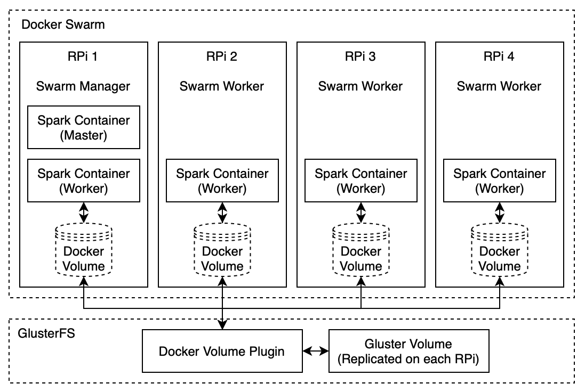

# Docker Swarm Spark Cluster Raspberry Pi 4 ARM


Deploy an [Apache Spark](https://spark.apache.org) cluster in standalone mode on a [Raspberry Pi 4](https://www.raspberrypi.org) using [Docker Swarm](https://docs.docker.com/engine/swarm/swarm-tutorial/create-swarm/).

1. Install [Docker](https://docs.docker.com) on all machines.

2. Initialize a [Swarm](https://docs.docker.com/engine/swarm/swarm-tutorial/create-swarm/). Make sure you have non-changing IP-address.

   ```bash
   # check swarm using command line
   docker node ls
   docker service ls

   # check swarm using a visualizer on port 80
   docker service create --name=viz --publish=80:8080/tcp --constraint=node.role==manager --mount=type=bind,src=/var/run/docker.sock,dst=/var/run/docker.sock alexellis2/visualizer-arm:latest
   ```

3. Install [GlusterFS]( https://www.gluster.org) (separate instructions down below)

   (This step is optional and creates a shared volumes accross all nodes (similar to Hadoop/HDFS). This is useful when the data is stored directly on the Raspberry Pi.)

4. Create an overlay network

   ```bash
   # create an attachable overlay network
   docker network create -d overlay --attachable spark
   ```

5. Run a [Spark](https://spark.apache.org) master

   ```bash
   # run spark master
   docker service create --name sparkmaster --network spark --constraint=node.role==manager --publish 8080:8080 --publish 7077:7077 --mount source=gfs,destination=/gfs pgigeruzh/spark:arm bin/spark-class org.apache.spark.deploy.master.Master
   ```

   "--network spark" attach the overlay network (otherwise spark master and workers can't communicate)  

   "--constraint=node.role==manager" restricts the container to run only on the master node  

   "--publish 8080:8080" opens port 8080 (Spark Master Web UI) for access outside the swarm  

   "--publish 7077:7077" opens port 7077 (Spark Master Listen) for access outside the swarm  

   "--mount source=gfs,destination=/gfs" mounts glusterfs using the docker volume plugin  

6. Run a [Spark](https://spark.apache.org) workers

   ```bash
   # run spark workers
   docker service create --replicas 4 --replicas-max-per-node 1 --name sparkworker --network spark --publish 8081:8081 --mount source=gfs,destination=/gfs pgigeruzh/spark:arm bin/spark-class org.apache.spark.deploy.worker.Worker spark://sparkmaster:7077
   ```

   "--replicas 4" deploys four workers  
   "--replicas-max-per-node 1" allows only one worker per node  

7. Run [JupyterLab](https://jupyter.org)

   ```bash
   # run jupyter lab
   docker service create --name jupyterlab --network spark --publish 8888:8888 --mount source=gfs,destination=/gfs pgigeruzh/spark:arm jupyter lab --ip=0.0.0.0 --allow-root --NotebookApp.token='' --NotebookApp.password='' --notebook-dir='/gfs'
   ```

   "--publish 8888:8888" opens port 8888 (JupyterLab) for access outside the swarm  

8. Check if everything works

   ```bash
   # run an example with "spark-submit"
   # (overlay network has to be attached, hence, it only works on the master)
   docker run --net=spark pgigeruzh/spark:arm spark-submit --master spark://sparkmaster:7077 /usr/spark-2.4.5/examples/src/main/python/pi.py

   # or run your own code
   # (you need to mount your code as a volume with -v)
   docker run -v /home/pi/:/data -v gfs:/gfs --net=spark --rm pgigeruzh/spark:arm spark-submit --master spark://sparkmaster:7077 /data/pi.py

   # or directly use bash
   docker run -it -v /home/pi/:/data -v gfs:/gfs --net=spark --rm pgigeruzh/spark:arm bash
   ```

# GlusterFS

Docker Swarm (containers in general) is primarily for stateless applications (no data persistence). Yet, Spark requires data and by default, it uses [Hadoop](http://hadoop.apache.org). The problem is that a Hadoop cluster on Swarm does not persist data. It is not possible to mount a local volume because Swarm does not support shared volumes. For this reason, [GlusterFS]( https://www.gluster.org) (installed outside of Docker Swarm) can be used to share data between different nodes. Together with [this](www.github.com/trajano/docker-volume-plugins/tree/master/glusterfs-volume-plugin) docker volume plugin, it is possible to mount these shared volumes. It would be possible to run a Hadoop cluster on top of GlusterFS but the docker volume plugin does essentially the same with less overhead.

First, glusterfs needs to be installed and configured on every node. This step is unrelated to docker. The following example is for installing glusterfs on two nodes (192.168.2.202, 192.168.2.203):

```bash
# install glusterfs (all servers)
sudo apt-get install glusterfs-server -y
sudo systemctl start glusterd
sudo systemctl enable glusterd
systemctl status glusterd
sudo mkdir --parents /glusterfs/distributed

# probe peers (replace sample ip with servers)
sudo gluster peer probe 192.168.2.202
sudo gluster pool list

# create volume
sudo gluster volume create gfs replica 2 192.168.2.202:/glusterfs/distributed 192.168.2.203:/glusterfs/distributed force

# start volume
sudo gluster volume start gfs
sudo gluster volume info gfs
```

Now, glusterfs is running with a shared folder on /glusterfs/distributed. The next step is to install a docker plugin to be able to connect docker volumes with gluster volumes. This step needs to be done an all nodes.

```bash
# install docker volume plugin (all servers)
docker plugin install --alias gluster \
  jmb12686/glusterfs-volume-plugin \
  --grant-all-permissions --disable
docker plugin set gluster SERVERS=192.168.2.202,192.168.2.203
docker plugin enable gluster
docker volume create --driver gluster gfs
```

# Build Docker Image

```bash
# build docker image
docker build -t pgigeruzh/spark:arm .

# push to docker hub
docker login
docker push pgigeruzh/spark:arm
```